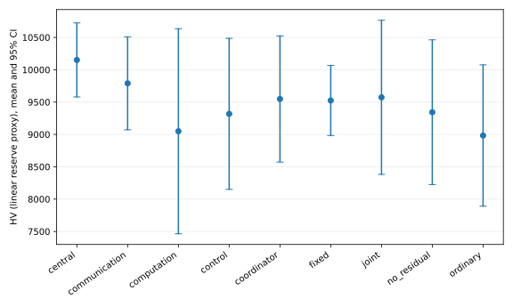
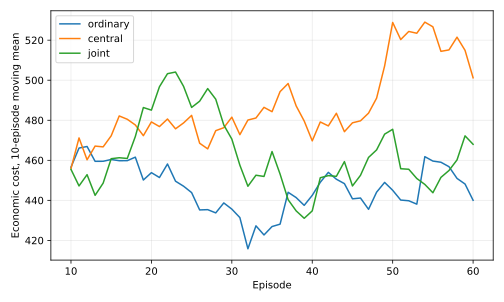

# 第九阶段实测与 P0/P1 验收

本阶段完成了新代码、扩大预算和公开英国数据实验，不能标记整份 P0/P1 清单全部验收通过。负结果与未实现部分保留；未将代理指标、更短训练或假设参数写成论文级验证。

## 实际完成量

- 九方法族、五训练种子；每方法族每种子 60 回合 × 8 步 = 480 次交互。固定权重族三个模型各 20 回合，总预算相同。共 55 个合成场景训练模型。
- 15 个预注册内部测试偏好，验证/测试场景隔离。统一验证集经验参考前沿，HV/IGD、置信区间、参考点敏感性及训练曲线均已导出。
- 七种扰动 × 三种 DT × 八个种子，共 168 个机制回合，记录候选与执行动作差异。
- 英国 OPSD + NESO 共 88 个完整日，保留一月训练、二月校准、三月测试；真实实验用 24 个训练日、20 个校准日、16 个测试日。三种子普通/Pareto 共 6 个模型、192 个策略评估回合。
- 下行/计算时序四条件共 32 回合；延迟、命令过期和中断触发现场同约束后备，所测回合全部完成。
- 新备用目标 v2 另做普通/Pareto 两模型的一种子短程训练、保存、重载和评价。正式多种子对照仍使用旧 v1 目标，两者不混比。
- 最终自动回归 83 项通过，包括真实碳模型重载、因果 EV 字段、新备用版本、命令队列与求解器问题复现。

## 核心结论

### DT 估计改善仍没有转化为控制收益

英国独立测试：物理 DT RMSE 0.034137，残差 DT 0.032767，改善约 4.0%。残差减物理的日成本差 +0.2445 GBP，95% CI [-0.0635, 0.5524]。没有成本改善证据。完整场景区间覆盖从物理 DT 的 15/16 降为残差的 12/16；延迟标签再校准后仍为 12/16。

七条件的残差/物理配对成本差区间全部包含零。候选和执行动作并非总相同；上行慢、组合扰动下安全投影缩小了动作差异，但不能把所有无收益现象都归因于安全层。现有短时域和费用对动作差异的敏感性也需要检验。

### 五种子尚不能证明算法优势

| 方法 | HV 均值 | 经验 IGD 均值 |
|---|---:|---:|
| 普通 MAPPO | 8983.19 | 1.3766 |
| 集中式 PPO | 10151.54 | 1.7665 |
| 固定权重族 | 9524.75 | 1.0816 |
| 仅控制 Pareto | 9318.32 | 1.4023 |
| 控制＋通信 | 9790.09 | 1.0736 |
| 控制＋计算 | 9049.15 | 1.4779 |
| C3 联合 Pareto | 9573.51 | 1.1774 |
| 去残差 | 9343.56 | 1.3810 |
| 加协调器 | 9548.28 | 1.2242 |

各方法相对普通 MAPPO 的配对 HV 差置信区间均包含零。HV 与 IGD 排序不同，不能只挑有利指标。指标仍使用线性备用代理，不能称 AC 认证备用前沿。480 次交互不是收敛证据。

### 备用审计发现问题并提供修正候选

旧备用申报 112 次激活中 55 次失败：41 次未找到满足指定目标的 AC 合格动作，14 次后续轨迹违规。新方案对现场当前状态的上下端点进行 AC 确认，缩小不可确认容量，后续使用 AC 校核经济规划。56 个机会均保留正容量；112 次激活无失败，平均容量从 278.21 kW 降至 241.41 kW。

这是有限场景证据。容量确认和后续控制都发生变化，不能仅归因于容量算法；功率口径仍是线性净购电，尚未完成含网损 PCC 实测功率跟踪。v2 已接通训练与版本校验，尚未按正式预算重训所有基线。

### 真实数据带来的两个代码修复

L1 投影在一个真实状态被预处理误报不可行，而同约束经济规划有解。使用剩余求解时间关闭预处理复核，解通过原残差检查，没有放松约束。另修复真实碳模型重载时错误要求合成碳因子的初始化路径；真实策略评估现已完成。

## 仍未完成的验收项

| 项目 | 当前缺口 |
|---|---|
| DT 控制贡献 | 需要改进预测/控制耦合或收窄贡献表述；现有证据不支持经济收益 |
| 不确定性可靠性 | 分布变化下覆盖不足；离线再校准尚未连接实际标签到达流程 |
| 新目标正式比较 | v2 全基线长预算多种子重训、收敛与更大独立测试集尚未完成 |
| 备用市场履约 | 含网损计量、连续激活、跨时域承诺与未来扰动下可靠性仍需补齐 |
| 真实 EV/DR | ACN 官方网页两次返回截断 JSON，未导入伪数据；导入接口已具备，但提前离站回放和真实 DR 参数未完成 |
| 工程安全与时延 | 设备实测校准、硬实时期限、物理不可行时紧急服务降级和递归可行性尚未完成 |

公开数据、字段、单位、信息假设和全部运行命令见 [实验协议](stage9_protocol.md)。机器可读统计与逐种子结果摘要见 [summary.json](../experiments/stage9/summary.json)。完整 P0/P1 状态保存在 [research_plan.json](research_plan.json)。
